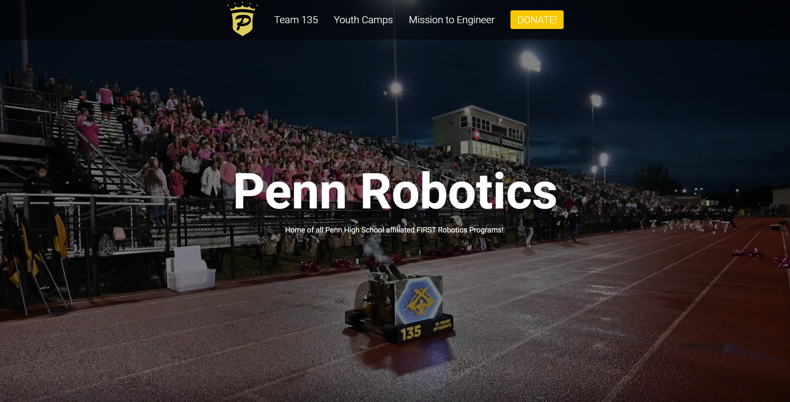

<h1 align="center">
  pennrobotics.org
</h1>

  The base iteration of pennrobotics.org built with HTML, SCSS, and JS, and hosted on Cloudflare, backend on Google Cloud VM instance.

## Important

If you choose to edit this website, please do not push the changes to this directory, as just in case everything hits the fan this directory will be working 100% of the time.

## 1. Documentation Outline

This documentation is aimed at future members of Penn Robotics looking to maintain and update this project. This document will contain a guide aimed at new web developers, along with information on project structure for those with more experience.

## 2. Public Forking and Use

This website is open-source and licensed under the MIT License. You're welcome to make any modifications, but please remember to credit the original work and acknowledge that your contributions build upon an existing project. The previous students who did work/are working on maintaining this project are Aydin Kurama & [Arda Kurama](https://ardakurama.com/) (Graduated)

## 3. Web Development Guide

This section of the documentation will underline the suggested way to learn web development.

It sounds cliche but tutorials are super helpful. I suggest watching [this html guide](https://www.youtube.com/watch?v=PlxWf493en4&ab_channel=freeCodeCamp.org) and these CSS guides: [Video 1](https://www.youtube.com/watch?v=OEV8gMkCHXQ&ab_channel=Fireship) and [Video 2](https://www.youtube.com/watch?v=1PnVor36_40). These will take you at most an hour to go through and will help you understand how to read the code. You have a full repository of changes to review, so you can always see how the website was previously built and try to replicate it. A lot of this comes down to practice, so don’t get discouraged!

Website development is an insanely good skill to have for your future (and looks good on college apps), whatever you are learning is worth it.

### Coding Basics

The text you see on websites is **all done** by HTML. HTML is what controls the text on the screen you could very well make an entire website just by using HTML.

The problem with just using HTML is that the website will look extremely ugly, it will look like this 

That looks pretty ugly, right? Exactly. That's why we use **CSS**, more specifically, for the Penn Robotics website we use **SCSS**, they are practically the same thing SCSS is a sub-processor of CSS so it makes it easier.

The big things you need to learn about SCSS:

**- SCSS Properties
- Nesting
- Media Queries
**
If you can understand these three things you will have a very good grasp on what you need to do. Again, I suggest tutorials.

Quick Explanation:
- **SSS Properties** are what make the website look good, example of these is like "color: #ffffff;" (changes color of the embed to white) or "margin-top: 50px;" (pushes the element 50 pixels down from whatever is   above it)

- **Nesting** is like the structure of SCSS, it's how you code an exampe of this is:

.example-container{
  color: #000000; // Changes color of the bigger section to black.
  .example-item{
    color: #ffffff; // Changes the color of the thing **within** the bigger section to white.
  }
}

- **Media Queries** allow you to change how the website looks on smaller devices. Imagine if your website showed a very large line of text, if you wanted to make it so that on phones (smaller devices) are able to see the text properly, you could lower how wide the text looks just on smaller devices. I suggest watching [this](https://www.youtube.com/watch?v=yU7jJ3NbPdA).

Also, this [Sass guide](https://sass-lang.com/guide) further explains these features.

## 4. Quickstart Guide - IMPORTANT

These various applications and softwares must be installed to properly access and edit this project.

### GitHub Desktop

This project is stored in GitHub. Install [GitHub Desktop](https://desktop.github.com/) to edit this project.

- You will also need to install [Git](https://git-scm.com/) at some point in this process .
- [This guide](https://docs.github.com/en/desktop/installing-and-configuring-github-desktop/installing-and-authenticating-to-github-desktop/setting-up-github-desktop) may be helpful while installing Github Desktop.

### Visual Studio Code

The best text editor (mentioned at the bottom of the tutorial above) is 100% VS Code. Install [VS Code](https://code.visualstudio.com/).

**READ THIS** Once inside VS Code, you will also need the following extensions:

- GitLens — Git supercharged
- HTML CSS Support
- JavaScript (ES6) code snippets
- Live Sass Compiler
- Live Server
- Prettier - Code formatter
- Project Manager

Without these extensions, the project will not look or function as best as it could function.

Once you are in VS Code click on the "extensions" button on the left of your screen, then just search the extension names and install.

## 5. Hosting Information

~~This website is hosted on Google Cloud Platform (GCP) under the website-specific email pennroboticswebsite@gmail.com. This email is connected to Email, Google Cloud Platform, Google Domains, Google Search Engine, and Font Awesome. Do not use it for non-website related tasks. Ask Mr. Marsh for its password.~~

**^^^** The text above is striked through as the website is currently hosted on Cloudflare with the same email. The email is still connected to everything it was previously linked to but the following are no longer in **active use:**

- Google Domains
- Google Cloud Platform (sort of, read further)

Instead of Google Domains, we are using [Cloudflare as our domain registrar](https://www.cloudflare.com/products/registrar/).
Instead of Google Cloud Platform, to host the website we are using [Cloudflare Pages](https://pages.cloudflare.com/) **eep reading further into API**

## 6. API

When the website was originally created, there was no backend API, I **highly** suggest [watching this](https://www.youtube.com/watch?v=ByGJQzlzxQg) to understand what an API is. To put it bluntly, the API allows the website to FETCH information which means it can dynamically update the website without changing any of the code, so if you wanted to change what the title of the website is without completely re-uploading all the code, you could do that with an API. 

To add this API to the website we moved to Cloudflare so the actual files of the website are hosted on Cloudflare Pages, but the API is hosted on Google Cloud Platform, specifically, it is a [Compute Engine](https://cloud.google.com/products/compute?hl=en) (like a virtual machine) instance. So we are still using Google Cloud Platform, but for a different reason.

## 7. Editing the Website

First, test the build on your local machine and make sure it actually **works**, test everything.

- Use Google Cloud Platform to update the API code.
- Use Cloudflare for everything else like: Website Hosting, DNS Records, Domain Registration
- Use Google Search Engine to manage SEO, view current Google indexing/crawling, and view website analytics *though Cloudflare does have built-in analytics*.

1. **To edit the Cloudflare Pages** (the website's files) go the [Cloudflare Dashboard](https://dash.cloudflare.com/). Using the same pennroboticswebsite@gmail.com email as mentioned before.
2. Click on the search button "Go To" and type **Workers & Pages**, once you are there click on penn-robotics. Once you are there, you will see all the previous deployments.
   
  **If you ever mess anything up you can *always* rollback to a previous deployment (version) by clicking on the three dots of that deployment that you want to rollback to, then clicking "Rollback to this deployment" **IF YOU DO THIS, YOU *MIGHT* NEED TO CHANGE THE API CODE TO ENSURE THE VERSIONS ARE COMPATIBLE** check to see if the version that you are rolling back to uses a different version of the API.
   
3. Now that you are in workers & pages, click on "Create Deployment" in the upper-righthand corner of your screen and simply drag and drop all of the files. **Crucial: Make sure there are no "git" files/folders like "gitattributes"**. You can choose to push that deployment straight to production (which means it is the public, real version of the website), or you can push to preview, which will NOT mess with the real website and allows you to check your work.
4. DONE! The website's code is updated.

## 6. Resources

This project utilizes many JavaScript libraries, GitHub repositories, and online resources for more complex features. These are linked below.

- https://github.com/mattboldt/typed.js JS typing animation
- https://github.com/nolimits4web/swiper JS image slider
- https://github.com/dimsemenov/PhotoSwipe JS image gallery
- https://github.com/dev-ggaurav/responsive-hamburger-tutorial HTML, CSS, and JS hamburger menu
- https://fontawesome.com/ Online icon library

## 7. Continuity Plan

The website as I am leaving it will be permanently stored in this GitHub repository. To make updates in the future:

1. Fork this repository
2. Make the edits
3. Upload the edited files to Cloudflare Pages. **Website updates will not show unless uploaded to Cloudflare Pages.**

Future members can use any GitHub account to make a project fork, and none of these forked repositories will be linked to the project. Make forks as needed, but try to keep everything organized.

As a fallback, if the website ever falls into an unrepairable position, copy the files in this GitHub repository into the Cloudflare Pages, and the website will return to an older, but working version.

Good luck Penn Robotics! If you ever have a large problem with this project, contact one of the previous website developers. Most Recent Developer: aydinkurama@gmail.com Least Recent Developer: ardakurama@gmail.com

